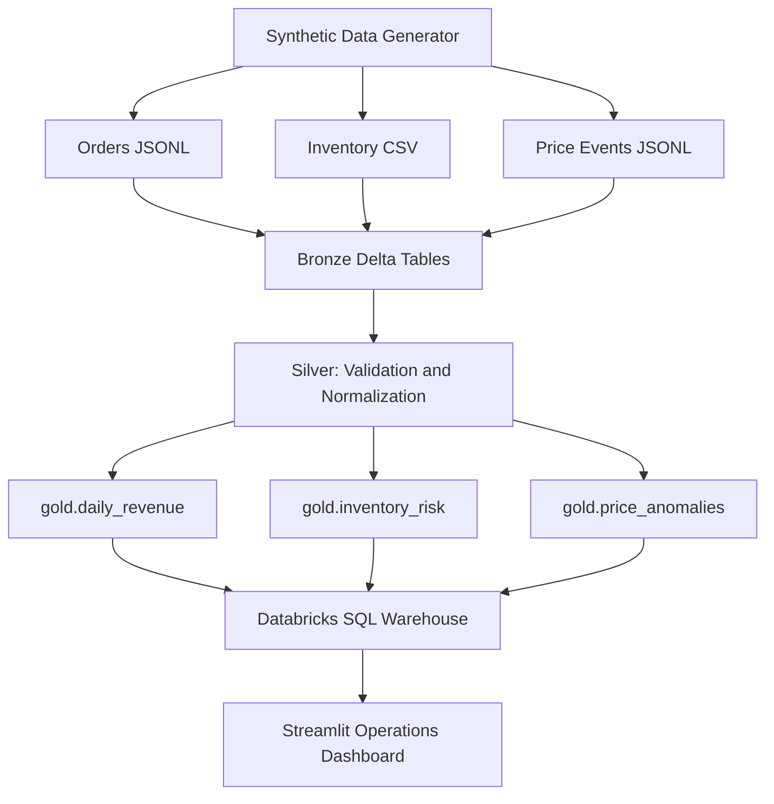

# Architecture

## System Context

Acme Marketplace operates three independent operational systems — an order service, an inventory management system, and a pricing service — each producing data in different formats and on different schedules. The lakehouse provides a single, versioned, queryable foundation that unifies these streams.

## Data Flow

## Data Sources

| Source               | Format | Frequency       |
| -------------------- | ------ | --------------- |
| Order service        | JSONL  | Event-driven    |
| Inventory management | CSV    | Periodic export |
| Pricing service      | JSONL  | Event-driven    |

## Bronze Layer

**Responsibility:** Raw data preservation.

- Ingest data with minimal transformation
- Preserve all original fields, including malformed values
- Add `_ingested_at` and `_source_file` metadata columns
- Use permissive schema to absorb schema drift (StringType for numeric fields)
- Enable reprocessing and auditability

Tables: `bronze.orders`, `bronze.inventory`, `bronze.price_events`

Bronze never deletes or rejects records. All source data is available for reprocessing or investigation at any time.

## Silver Layer

**Responsibility:** Validation, normalization, deduplication.

- Cast raw string fields to correct types (timestamps, numbers)
- Validate business rules for each source
- Write invalid records to quarantine tables with explicit `_quarantine_reason`
- Deduplicate orders by `order_id` (keep latest by `ordered_at`)
- Flag inventory records with negative quantities without quarantining them

Tables: `silver.orders`, `silver.inventory`, `silver.price_events`

Quarantine tables: `silver.quarantined_orders`, `silver.quarantined_inventory`, `silver.quarantined_price_events`

Invalid records are never silently dropped. The quarantine table is the investigation surface for data quality issues.

### Silver Quarantine Reasons

| Reason               | Table                             |
| -------------------- | --------------------------------- |
| `MISSING_ORDER_ID`   | orders                            |
| `MISSING_PRODUCT_ID` | orders / inventory / price_events |
| `INVALID_QUANTITY`   | orders                            |
| `INVALID_PRICE`      | orders                            |
| `INVALID_TIMESTAMP`  | all                               |
| `DUPLICATE_ORDER`    | orders                            |
| `MISSING_WAREHOUSE`  | inventory                         |
| `INVALID_OLD_PRICE`  | price_events                      |
| `INVALID_NEW_PRICE`  | price_events                      |

## Gold Layer

**Responsibility:** Business-oriented aggregations and analytics.

Gold tables are derived exclusively from validated Silver data. Duplicates, nulls, and invalid values cannot reach Gold.

### daily_revenue

Aggregates clean order data by date and channel. Revenue is computed as `quantity * unit_price`. Duplicate orders are already excluded at the Silver layer, so Gold revenue is guaranteed to reflect actual transactions.

### inventory_risk

Calculates `avg_daily_sales` from order history, then derives `days_of_stock = current_quantity / avg_daily_sales`. Products with fewer than 7 days of stock are flagged. Division by zero is handled explicitly — products with no sales history receive `risk_level = NORMAL` and `days_of_stock = NULL`.

| Risk Level | Threshold                     |
| ---------- | ----------------------------- |
| CRITICAL   | < 3 days                      |
| HIGH       | < 7 days                      |
| NORMAL     | >= 7 days or no sales history |

### price_anomalies

Flags price change events where `abs(price_change_ratio) >= 0.30`. The threshold is a deterministic business rule, not a machine learning model. See `docs/technical-evaluation.md` for the architecture decision.

## Serving Layer

Gold tables are exposed through a Databricks SQL Warehouse. The Streamlit operations dashboard queries Gold tables via the Databricks SQL connector using a personal access token.

The serving architecture deliberately keeps the application stateless — the dashboard always reads the latest Gold state on each refresh.

## Failure Handling

| Failure Mode                      | Behavior                                                                  |
| --------------------------------- | ------------------------------------------------------------------------- |
| Malformed source record           | Written to quarantine table with reason; pipeline continues               |
| Duplicate order ID                | Older record quarantined as `DUPLICATE_ORDER`; latest survives            |
| Bronze schema drift               | Extra columns accepted (permissive schema); Silver validates known fields |
| Negative inventory                | Flagged with `negative_stock=true`; not quarantined                       |
| Division by zero (inventory risk) | `days_of_stock = NULL`, `risk_level = NORMAL`                             |

## Data Quality Strategy

The data quality strategy follows a layered defense model.

- **Bronze** accepts everything and preserves it
- **Silver** enforces contracts and makes violations explicit
- **Gold** computes only from clean data

This separation ensures that data quality failures are observable without blocking the pipeline, and that business metrics are never polluted by invalid data.
